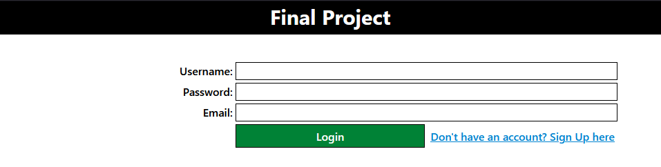
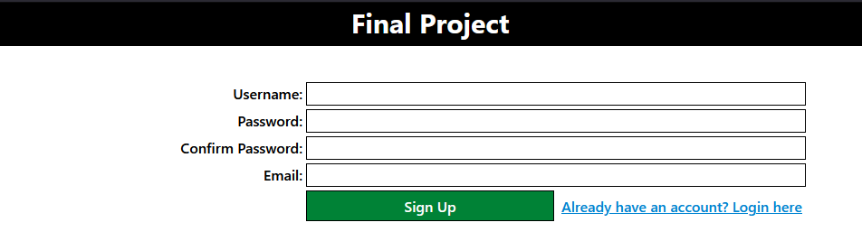
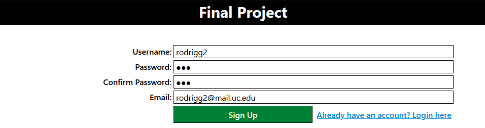
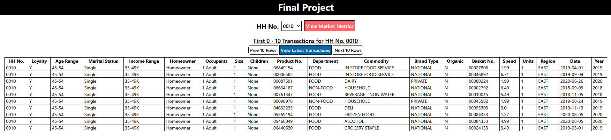
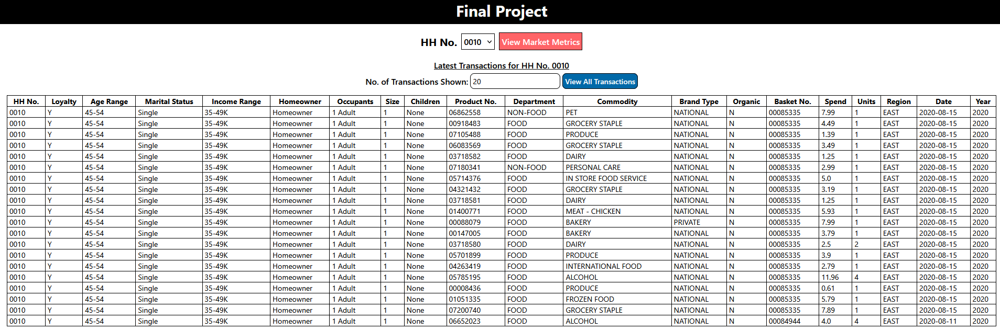
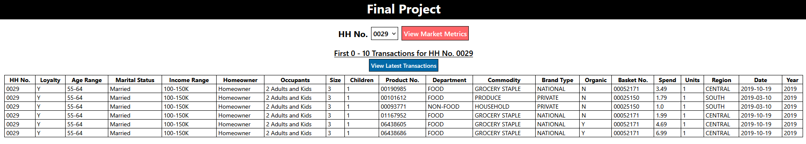
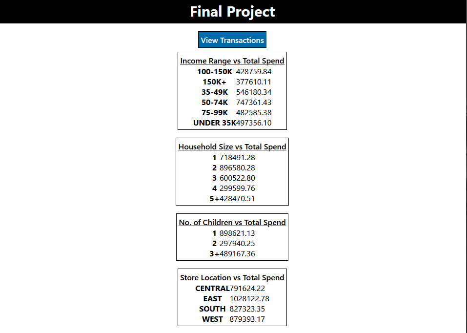

# Cloud Computing Final Project

**Uses the MVC Project Template for [BlackSheep](https://github.com/Neoteroi/BlackSheep)**

## Tour
First, you start at the login screen:


If you don't have an account, click the blue link to the sign-up page:


Note that the login and sign-up forms are complete with error validation and CSRF protection!

Next, create an account:


Provided that the sign-up has been validated (meaning passwords match and the username hasn't been taken), you'll be redirected to the home page:


BE SURE TO ENABLE COOKIES! This web app uses session cookies for authentication.

If you click the `View Transactions` button, you'll be redirected to the following dashboard:


Here, you can iterate over the transaction history for HH No. 10 using the `Prev` and `Next` buttons. Alternatively, you can click the `View Latest Transactions` button to view/load the latest transactions. Note that you can change the number of transactions being viewed in the boxed input. In this case, the number of latest transactions was updated from 10 to 20:


It is imporant to note that there is a one second delay between inputs. So wait a moment for the updated list of recent transactions to display.

If you would like to change which household's transactions you are viewing, using the dropdown menu at the top of the page. Shown below are the transactions for HH No. 29. Note that this change is viewable in the dropdown as well:


Lastly, you can view some market metrics that were calculated by clicking the `View Market Metrics` button. Doing so will bring you to this final page:


## Local Devopment Notes
Start server:
```bash
python3 -m venv venv
source venv/bin/activate.fish 
pip install -r requirements.txt
python dev.py
```

Migrate Local:
```bash
cd sql

sudo -u postgres createdb cloud
sudo -u postgres psql -d cloud -f create.sql
sudo -u postgres psql -d cloud
\copy households FROM 'households.csv' (format csv, null "null", DELIMITER ',', HEADER);
\copy products FROM 'products.csv' (format csv, null "null", DELIMITER ',', HEADER);
\copy transactions FROM 'transactions.csv' (format csv, null "null", DELIMITER ',', HEADER);

create role app with login password '{password}';
GRANT CONNECT ON DATABASE cloud to app;
GRANT SELECT ON ALL TABLES IN SCHEMA public TO app;
GRANT INSERT ON ALL TABLES IN SCHEMA public TO app;
GRANT USAGE ON SEQUENCE public.users_id_seq TO app;
```

## Cloud Development Notes
Useful Links:
- [Connect to Google Cloud SQL w/ PSQL](https://cloud.google.com/sql/docs/postgres/connect-admin-ip)
https://cloud.google.com/sql/docs/mysql/connect-app-engine-standard
- [App Engine Python](https://cloud.google.com/appengine/docs/standard/python3/building-app)

Migrate to Cloud SQL:
1. First, run:
    ```bash
    cd sql
    psql "sslmode=require hostaddr=IP_ADDR user=postgres dbname=postgres"
    \i create.sql
    \copy households FROM 'households.csv' (format csv, null "null", DELIMITER ',', HEADER);
    \copy products FROM 'products.csv' (format csv, null "null", DELIMITER ',', HEADER);
    \copy transactions FROM 'transactions.csv' (format csv, null "null", DELIMITER ',', HEADER);
    ```
2. Then, create an `app` user by following this [tutorial](https://cloud.google.com/sql/docs/postgres/create-manage-users)

Deploy:
1. gcloud app deploy
2. gcloud app logs tail -s default